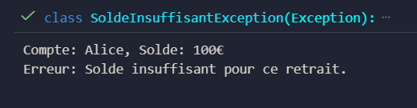
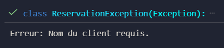
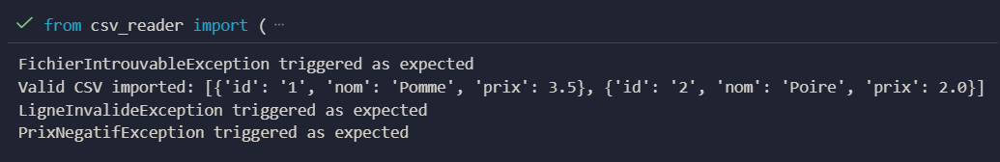

# Python Exceptions Exercises

## Exercice 1 – Gestion des erreurs bancaires

### Objectif pédagogique
Comprendre la gestion des erreurs en Python, notamment la définition et l'utilisation de ses propres exceptions pour capturer des cas métiers spécifiques.

### Exemple d’utilisation
- Créer un compte bancaire
- Déposer ou retirer de l'argent
- Lever une exception si le solde est insuffisant

### Résultat attendu
- Affichage du solde
- Message d'erreur si retrait impossible  

---

## Exercice 2 – Gestion des erreurs pour un système de réservation

### Objectif pédagogique
Apprendre à concevoir un système robuste en définissant plusieurs types d’exceptions spécifiques à un domaine métier, tout en appliquant de bonnes pratiques de validation et de journalisation.

### Scénario
- Vérifier que le nombre de places est suffisant
- Vérifier que l’entrée du client est valide
- Vérifier que la réservation ne dépasse pas la capacité maximale

### Exemple d’utilisation
- Créer un événement
- Réserver des places
- Lever des exceptions si les règles ne sont pas respectées

### Résultat attendu
- Confirmation des réservations valides
- Messages d'erreur pour les cas invalides  

---

## Exercice 3 – Import CSV sécurisé avec exceptions personnalisées

### Objectif pédagogique
Renforcer la maîtrise des exceptions personnalisées appliquées à la lecture/validation de fichiers, en séparant clairement le flux nominal et les erreurs métier.

### Scénario
- Lire un fichier CSV d’articles (id;nom;prix)
- Vérifier l’existence du fichier
- Contrôler le format de chaque ligne
- Lever des exceptions spécifiques si :
  - Le fichier est introuvable
  - Une colonne manque ou dépasse la valeur attendue
  - Le prix n’est pas numérique ou est négatif

### Points clés à implémenter
- Une fonction `charger_csv(chemin)` qui renvoie une liste de dictionnaires ou lève une exception
- Un gestionnaire `try / except` dans `main.py` pour afficher les messages d’erreur
- Logger optionnel pour tracer les anomalies
- Ignorer les lignes vides
- Valider que le prix est > 0 et convertible en float

### Jeux de tests recommandés
- CSV valide de trois articles
- Fichier absent
- Ligne avec trois colonnes mais prix texte
- Ligne avec prix négatif

### Résultat attendu
- Liste des articles importés correctement
- Messages d'erreur clairs selon le type d'exception  

### Livrables
- `csv_reader.py` : fonctions et exceptions
- `main.py` : point d’entrée
- `tests_csv.py` : tests unitaires
